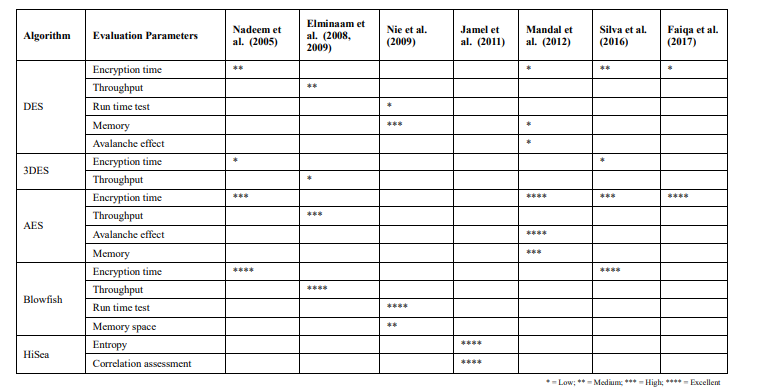

# Description

# Getting Started 🚀

### Prerequisites for running the Notebooks for the simulations

* <a href=https://www.python.org/downloads/release/python-370/> Python 3.7 or Greater</a>
* <a href=https://pip.pypa.io/en/stable/installation/> pip 21.3.1 or Greater</a>

After installing the requirements, run the following commands in order

```bash
# creates python virtual environment for the project
python -m venv ./venv 

# activates virtual environment; this is on Mac or Linux
source ./venv/bin/activate 

# This is for windows (Using Powershell)
.\venv\Scripts\activate.bat 

# upgrade pip to get the latest packages
python -m pip install --upgrade pip 

#Is used to check if the virtual environment is being used 
pip -V  

# Install all required dependencies
pip install -r requirements.txt 
```

### Cyclomatic Complexity

The cyclomatic complexity of the code can be tested using the following commands

``` bash
radon cc -a src 
```

### Commands for the application

``` bash
# Add-new-role
python src/main.py add-new-user-and-role --username-admin <CHANGE_USER> --password-admin <CHANGE_PASSWORD> --new-username <CHANGE_USER>--new-user-password <CHANGE_PASSWORD> --role NORMAL_USER

# Login
python src/main.py login --username <CHANGE_USER> --password <CHANGE_PASSWORD> 

# Add Music Data
python src/main.py add-music-data --username <CHANGE_USER> --password <CHANGE_PASSWORD>  --music-file-path tests/files/audio_file_test.mp3 --music-score 1 --lyrics-file-path tests/files/test.txt  

# list with token
 python src/main.py list-music-data  

 #list without token
 python src/main.py list-music-data --username <CHANGE_USER> --password <CHANGE_PASSWORD>

# Update music data
python src/main.py update-music-data --username <CHANGE_USER> --password <CHANGE_PASSWORD> --music-file-path tests/files/audio_file_test.mp3 --music-data-id <CHANGE_MUSIC_DATA_ID>

# Update music data without music file
python src/main.py update-music-data --username <CHANGE_USER> --password <CHANGE_PASSWORD>  --music-data-id <CHANGE_MUSIC_DATA_ID> --lyrics-file-path tests/files/test.txt  --music-score 2132 

# Delete music as normal user
python src/main.py delete-music-data --username <CHANGE_USER> --password <CHANGE_PASSWORD> --music-data-id <CHANGE_MUSIC_DATA_ID>

# Download data as an admin
python src/main.py download-music-data --username <CHANGE_USER> --password <CHANGE_USER> --music-data-id <CHANGE_MUSIC_DATA_ID>
```

### Run tests with coverage

To prove the

```bash
coverage run --source=src -m pytest -v tests && coverage report -m 

# Generate result in 
coverage html && open htmlcov/index.html  
```

### Libraries Used

| Library       | Justification                                       |
|---------------|-----------------------------------------------------|
| Typer         | Create the Entry Point for the CLI APP              |
| SQLModel      | ORM mapper for Python to interact with the database |
| PyJWT         | To Create JWT Tokens                                |
| argon2-cffi   | To Hash data using Argon2                           |
| pycryptodomex | To encrypt data using AES-256 (using GCM Mode)      |

### Role-based access control

To apply the least-privilege the application uses role based access control. It only allows actions to certain
roles, and denies them if they are not allowed.

#### Types of roles in the Project

Currently, there are only two types of roles in this application but can the roles can be extended
by modification of some code.

| Role id | Role Name   | Description                                                              |
|---------|-------------|--------------------------------------------------------------------------|
| 1       | ADMIN       | Is allowed to do all the actions                                         |
| 2       | NORMAL_USER | Is only allowed to view/change/update/delete items created by themselves |

### JWT Tokens for listing data

The Jwt token store user claims like user id, expiry date, permissions (Jones, M., Bradley, J. and Sakimura, N., 2015).
This token is stored in a config when the users successfully logs-in. The token in this
application is only used for read actions, as this would give the user a better user experience
by not making them log-in multiple times to read data. However, for sensitive actions such as delete, modify, and add a
re-authentication is always required for each action.

#### JWT Signature Algorithm

To prevent tampering of data an asymmetric digital signature EdDSA using Ed25519 algorithm because of the following
reasons:

* This algorithm is lightweight and performant due to its small key sizes (64 or 114 bytes) and signatures (Josefsson,
  S. and Liusvaara, I., 2017).
* The algorithm is collision resilient.
* It provides protection against different kinds of attacks like side-channel analysis, differential power analysis
  attacks(Bisheh-Niasar, M et.al, 2021).
* It is a well renowned algorithm to apply digital signatures (Bisheh-Niasar, M et.al, 2021).

### Data Encryption

To ensure data confidentiality in the project, the data has to be encrypted using a cryptographic algorithm. As
the cryptographic algorithm, the symmetric key algorithm AES-256 is applied to encrypt the sensitive data.

This algorithm is chosen for the following reasons:

* AES-256 provides a good mixture of performance for memory, integrity and confidentiality (
  Mushtaq, M.F. et al. 2017).
* A good level of avalanche effect, making small changes in the data will change the encrypted text making it less
  predictable to break.
* Memory performance is essential for this application as binary data, such as audio files and lyrics, will also be
  encrypted, which is more memory intensive than small texts.
* AES-256 can resist quantum computing attacks based on shor's algorithm (Rao, S., Mahto et al. 201).
  

<p style="text-align: center;"><b>Encryption Algorithm comparison (Mushtaq, M.F. et al. 2017)</b></p> 

#### AES-256 Mode Selection

According to Hameed, M.E et al. 2019, Counter Mode(CTR) of AES encryption is the one of the best and most accepted block
ciphers modes. However, the CTR mode cannot prevent bit-flipping of by third person, but the Galois/Counter Mode (GCM)
an
extension of the CTR prevents its holding all the advantages of CTR, i.e. parallelization, integrtiy using
authenticated encryption, and performance (Satoh, A.,
2006). Therefore out of the different mode GCM is applied to this project.

###### Private Key and salt generation

Using Scrypt to generate human-readable private keys for AES-256 with GCM mode is selected
as it is a secure algorithm (Encryption and decryption with AES GCM (n.d))

### Data Integrity

The project handles the upload of various music data, such as audio and lyric files, which has to ensure that no
tampering within the database is
carried out. A checksum is calculated using the SHA-256 hash function(Rachmawati.D et al., 2018)to ensure that the data
inside the database are not tampered with for spoofing attacks.

### Password Policy and ReDoS protection

To ensure a strong password policy the new password is tested against a regex of with the policy pattern mentioned
below:

``` python

Pattern(
    length=8,  # min length: 8
    uppercase=1,  # need min. 1 uppercase letters
    numbers=1,  # need min. 1 digits
    special=1,  # need min. 1 special characters
    max-length=30,  # need min. 30 max length
)
password_pattern = "^(?=.*?[A-Z]{2,})(?=.*?[a-z]{2,})(?=.*?[0-9]{2,})(?=.*?[\[\]<>#?!@$%^&*-]{2,}).{8,30}$"
```

To prevent ReDoS the input validation for the Regex for password policy applies the following points as mentioned in
Input validation cheat sheet(n.d), OWASP:

* Minimum password length and maximum length
* There is a defined allowed characters which are accepted.

Additionally, to avoid using compromised passwords an additional check to Have I been Pawned API is conducted to see if
the password is compromised (Pal, B et al. 2019).

#### Input Validation and sanitization

According to Input validation cheat sheet(n.d), OWASP the main goal of input validation is to prevent malformed data
to be persisted in the database or the system to prevent malfunctioning. Input validations carried out:

* Maximum and Minimum values range (Min 5 and Max 50 )for username and passwords.
* Range check for integer so that no negative values and no max value of the integer are provided.
* The file names also have a maximum length.
* Allow list for types of Audio files such as (.mp3, .wav, aac, wma, ogg, and flac).
* Allow list for types of lyrics files such as (LRC and txt).
* Maximum size for upload of audio file (30 MB) and max file for Lyrics(2MB).

## Buffer Overflow Prevention

Following the paper (Yadav, S., Ahmad, K. and Shekhar, J., 2011) the following protections for buffer overflow were
applied:

* Input validation and sanitization.
* Using Python as a programming language as this langauge has some built in protection to automatic bound checking of
  buffers (Frykholm, N., 2000).
* Using bandit to scan for vulnerable libraries which could contain CVE's and also cause buffer-overflow.

#### Improvements for the future

* User-Id should not be a numeric value but a unique UUID, so that an attacker cannot do an enumeration attacks,
  by guessing the id.
* The audio files must be validated if the file is really an audio file, not only testing the file extension.
* Encryption and decryption using more threads to make this process faster and improve the application performance.

### References

* Bisheh-Niasar, M., Azarderakhsh, R. and Mozaffari-Kermani, M., 2021. Cryptographic accelerators for digital signature
  based on Ed25519. IEEE Transactions on Very Large Scale Integration (VLSI) Systems, 29(7), pp.1297-1305.
* Encryption and decryption with AES GCM (n.d) Essential Programming Books. Available
  from: https://www.programming-books.io/essential/go/encryption-and-decryption-with-aes-gcm-474ffe54eb92473b908b5ef162789cad (
  Accessed: 16 July 2023).
* Frykholm, N., 2000. Countermeasures against buffer overflow attacks. RSA Tech Note, pp.1-9.
* Hameed, M.E., Ibrahim, M.M., Abd Manap, N. and Attiah, M.L., 2019. Comparative study of several operation modes of AES
  algorithm for encryption ECG biomedical signal. International Journal of Electrical and Computer Engineering, 9(6),
  p.4850.
* Input validation cheat sheet(n.d), OWASP Input Validation - OWASP Cheat Sheet Series. Available
  from: https://cheatsheetseries.owasp.org/cheatsheets/Input_Validation_Cheat_Sheet.html (Accessed: 18 July 2023).
* Jones, M., Bradley, J. and Sakimura, N., 2015. Json web token (jwt) (No. rfc7519).
* Josefsson, S. and Liusvaara, I., 2017. Edwards-curve digital signature algorithm (EdDSA) (No. rfc8032).
* Mushtaq, M.F., Jamel, S., Disina, A.H., Pindar, Z.A., Shakir, N.S.A. and Deris, M.M., 2017. A survey on the
  cryptographic encryption algorithms. International Journal of Advanced Computer Science and Applications, 8(11).
* Pal, B., Islam, M., Bohuk, M.S., Sullivan, N., Valenta, L., Whalen, T., Wood, C., Ristenpart, T. and Chatterjee, R.,
  2022. Might i get pwned: A second generation compromised credential checking service. In 31st USENIX Security
        Symposium (USENIX Security 22) (pp. 1831-1848).
* Rachmawati, D., Tarigan, J.T. and Ginting, A.B.C., 2018, March. A comparative study of Message Digest 5 (MD5) and
  SHA256 algorithm. In Journal of Physics: Conference Series (Vol. 978, p. 012116). IOP Publishing.
* Rao, S., Mahto, D., Yadav, D.K. and Khan, D.A., 2017. The AES-256 cryptosystem resists quantum attacks. Int. J. Adv.
  Res. Comput. Sci, 8(3), pp.404-408.
* Satoh, A., 2006, May. High-speed hardware architectures for authenticated encryption mode GCM. In 2006 IEEE
  International Symposium on Circuits and Systems (pp. 4-pp). IEEE.
* Yadav, S., Ahmad, K. and Shekhar, J., 2011. Classification and prevention techniques of buffer overflow attacks. In
  Proceedings of the 5th National Conference (pp. 10-11).
